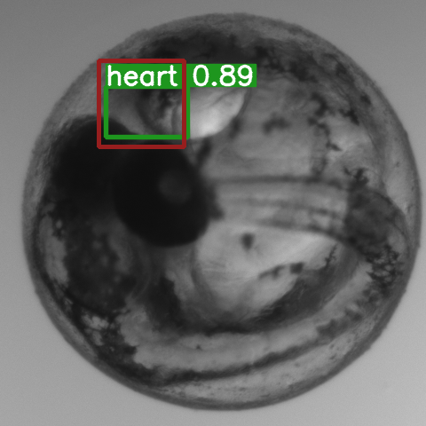

# Medaka Heart Detection
##### Code published and documented by Marcus Buchwald

This repository provides the code for Detection of the beating Medaka Heart in Embyros. The model was trained as part 
of the Bachelorthesis of Ben Dangelmayr in the EMCL Group of Prof. Heuveline, supervised by Marcus Buchwald. 
The code is based on the Yolo5 network published here https://github.com/ultralytics/yolov5.

The code contains the best performing model of the experiments conducted in the Bachelorthesis. The model was trained on 
a mere 60 videos of Medaka. The hyperparemeters for the detections are fixed but can be altered in `detect.py`.

## Data
A video which shall be detected should be stored as a folder containing the 240 .tif files. The model was only trained 
and tested with videos of 240 .tif frames but should be agnostic about the number of frames. However the video needs to be 
composed of at least 20 images as this is the input depth. 

The .tif files belonging to on Video should be stored in

- `data/test/images/*video_name*/`

If you have the .json ground truth bounding box points, put them as a txt file into

- `data/test/labels/`

The .json file should have the filename `*video_name*.json`.

## Prerequisites

Python 3.8 is used. 

Install torch, torchvision and torchaudio via:

`pip install torch==1.11.0+cu115 torchvision==0.12.0+cu115 torchaudio==0.11.0+cu115 --extra-index-url https://download.pytorch.org/whl/cu115`

Install the rest of the requirements by running in the `Medaka_Heart_Detection` directory.

`pip install -r requirements.txt`.

## Preprocessing and Run

The .tif frames have an original size of 900x900. For the network we center-cropped the images to 480x480.
For this preprocessing step run the following comman on the original sized video folder :

`python preprocess_videos.py`

Run the detection using: 

`python detect.py --device cpu --source data/test/images/*video_name*`.

In case you have a GPU you might can speed up the inference with `--device cuda:0`. 
As all consecutive 20-frame-volumes from 1-240 (hence 220 volumes) are processed from which the best prediction is 
picked, the detection on a video might take a couple of seconds on CPU. This can however be optimized in future 
improvements of the network.

The resulting experiments containing the prediction images and relative bounding box coordinates are stored in 

- `runs/detect/`

